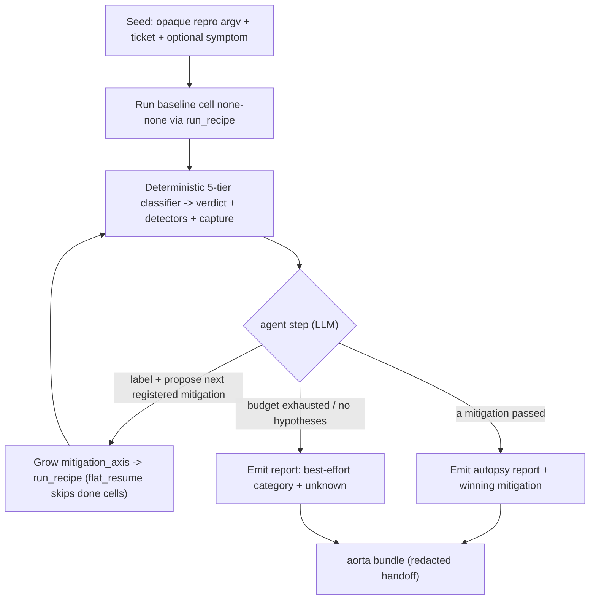

# Aorta Probe Agent — Closed-Loop Mitigation Search

**Author:** AORTA platform · June 2026

---

## Agenda

1. Problem — static probe matrices and manual correlation
2. Design — one agent loop on top of `aorta probe`
3. Safety boundaries
4. Reuse — shared engine and resume-as-memo
5. Relationship to cluster-scale agent systems
6. Build phases
7. Implementation plan (engineering appendix)

---

## Problem — Static Matrices, Manual Correlation

`aorta probe` runs an opaque user launch command across a **pre-written**
`mitigation_axis × diagnostic_axis` cartesian product. A human must:

1. Guess which mitigations belong in the matrix and in what order.
2. Read per-cell `failure_detectors_fired` and `capture` fields by hand.
3. Name the failure category and decide when to stop.
4. Package artifacts for handoff.

Most time is spent in **signal correlation**, not in running the repro.
The agent compresses that loop while leaving execution and verdicts to the
existing deterministic probe machinery.

---

## Design — One Agent Loop on Top of Probe

Unlike cluster-scale three-agent systems (preflight / watchdog / autopsy at
the scheduler layer), the **Probe Agent** is a **standalone application-layer
loop**: it wraps the same `run_recipe` engine `aorta probe` uses, but
replaces the static matrix with a **hypothesis-driven search**.



### Agent step output (structured JSON)

| Field | Meaning |
|-------|---------|
| `category` | One of eight generic autopsy labels (see below) |
| `hypothesis` | Short natural-language explanation |
| `next_mitigations` | Registered mitigation names to try next (never raw argv) |
| `confidence` | 0.0–1.0 self-reported confidence |
| `stop` | True when the agent believes search should end |

### Autopsy category taxonomy

| Category | Typical probe signals |
|----------|----------------------|
| `rccl_hang` | `tier2:*` hang detectors, RCCL timeout patterns |
| `thermal_throttle` | Sustained perf drop + thermal context (when available) |
| `illegal_mem` | `tier4:hip_error`, illegal-access regex in stderr |
| `oom_fragment` | OOM / exit 137 patterns |
| `checkpoint_race` | Barrier / checkpoint boundary signatures |
| `launch_error` | Early exit, launch failures |
| `perf_regression` | Pass with warn detectors or confound regression |
| `unknown` | No confident mapping |

---

## Safety Boundaries (Non-Negotiable)

1. **Verdict source of truth** — Only the deterministic 5-tier classifier in
   `aorta.probe.classifier` sets `pass` / `fail`. The LLM never overrides it.
2. **Registered mitigations only** — Proposals resolve through
   `aorta.registry.get_mitigation`. Raw shell or argv changes are rejected.
3. **Bounded autonomy** — `max_iterations` and `max_walltime_sec` caps;
   optional approval gate before running mitigations flagged as needing ack.
4. **Optional LLM dependency** — LiteLLM lives behind the `[agent]` extra;
   a deterministic fake proposer supports offline tests with zero API calls.

---

## Reuse — Shared Engine, Resume as Memo

| Component | Role in agent loop |
|-----------|-------------------|
| `aorta.triage.runner.run_recipe` | Same entry point as `aorta probe` |
| `layout=flat_resume`, `resume_existing=True` | Skips completed cells — search tree memo |
| `aorta.probe.classifier` | Per-trial verdict + detectors |
| `aorta.instrumentation.environment` | `host_env.json` per ticket |
| `aorta bundle` | Redacted handoff at loop end |

Each iteration **grows** `mitigation_axis` on the probe recipe; cells already
present under `<output>/<ticket>/` are not re-executed.

---

## Relationship to Cluster-Scale Agent Systems

Cluster intelligence proposals (preflight / watchdog / autopsy at the
scheduler + omnistat + TraceLens layer) target **fleet-wide** failure modes.
The Probe Agent targets **single-repro mitigation search** at the application
layer.

| Layer | Scope | This agent |
|-------|-------|------------|
| Cluster autopsy | Post-mortem across nodes, traces, Prometheus | Future interop: cluster agent could invoke `aorta agent` with a frozen argv |
| **Probe agent** | Mitigation search on one opaque command | **Shipped here** |

Standalone today; integration is a one-slide handoff, not a hard dependency.

---

## Build Phases

| Phase | Deliverable |
|-------|-------------|
| **A** | `aorta agent` CLI + fake-LLM loop + `agent_log.jsonl` + tests (no API) |
| **B** | LiteLLM client + structured output + `agent_report.md` |
| **C** | Approval gates + `wake()` resume + optional `aorta bundle` at end |

---

## Implementation Plan (Engineering Appendix)

### Package layout

```
src/aorta/agent/
  __init__.py
  loop.py      # orchestration -> run_recipe
  llm.py       # AgentStep, FakeLLMProposer, LiteLLMProposer
  policy.py    # budget, registry filter, approval
  state.py     # agent_log.jsonl, wake()
  report.py    # agent_report.md writer
src/aorta/cli/agent.py
tests/agent/
docs/agent/aorta-probe-agent.md   # this file
```

### CLI

```bash
aorta agent \
  --output ./agent_results \
  --ticket ROCM-EXAMPLE \
  --max-iterations 8 \
  --symptom "illegal memory access after long run" \
  -- \
  python3 my_repro.py --steps 100
```

Install LLM support: `pip install 'amd-aorta[agent]'` (pulls `litellm`).
Default backend is `fake` (deterministic, offline-safe).

### State file

`<output>/<ticket>/agent_log.jsonl` — append-only JSON lines for resume and
audit. `wake()` replays tried mitigations and last category.

### CLI outcomes

| Outcome | Meaning |
|---------|---------|
| `baseline_pass` | `none-none` passed; repro OK without mitigations |
| `converged` | A non-baseline mitigation cell passed |
| `exhausted_candidates` | No more registered mitigations left to try |
| `agent_stop` | Proposer ended search for another reason |

### Tests

- Mock `run_recipe`; assert growing `mitigation_axis` and `flat_resume`.
- Policy rejects unregistered mitigation names.
- Fake-LLM loop converges when a mocked cell returns `pass`.
- `wake()` skips already-tried mitigations.

---

## Related docs

- [agentic-testing-guide.md](agentic-testing-guide.md) — usage, examples, LLM vs fake, under the hood
- [`docs/probe-188/usage.md`](../probe-188/usage.md) for probe-mode recipes
- `src/aorta/agent/` for the implementation.
