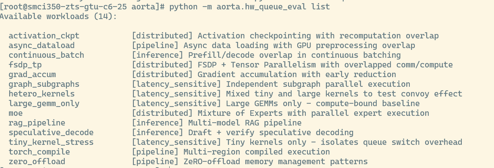

# Hardware Queue Evaluation — User Guide

A comprehensive guide for `aorta-hw-queue`, a framework for stress-testing GPU hardware queue scheduling with workloads requiring high stream concurrency.

---

## Table of Contents

- [Background](#background)
- [Installation](#installation)
- [CLI Reference](#cli-reference)
  - [list](#list)
  - [run](#run)
  - [sweep](#sweep)
  - [run-priority](#run-priority)
  - [compare](#compare)
  - [profile](#profile)
  - [info](#info)
- [Workloads](#workloads)
  - [Priority P0 (Critical)](#priority-p0-critical)
  - [Distributed Training](#distributed-training)
  - [Inference](#inference)
  - [Pipeline / System-Level](#pipeline--system-level)
  - [Latency-Sensitive](#latency-sensitive)
- [Distributed Mode](#distributed-mode)
- [Comms-Compute Overlap Options](#comms-compute-overlap-options)
- [Metrics](#metrics)
- [Configuration Options](#configuration-options)
- [Scripts](#scripts)
- [Analysis Workflows](#analysis-workflows)
- [Architecture](#architecture)
- [Troubleshooting](#troubleshooting)

---

## Background

Modern GPU workloads use multiple CUDA/HIP streams to overlap compute, communication, and data movement. When the number of software streams exceeds the number of physical hardware queues on the GPU, the runtime must multiplex streams onto queues. Poor queue mapping leads to:

- **Convoy effect**: Tiny kernels stuck behind large ones on a shared queue
- **Switch overhead**: Latency cost of context-switching between queues
- **Underutilization**: Idle compute units while waiting for queue dispatch

This framework quantifies these effects by running controlled workloads at varying stream counts and measuring throughput scaling, latency variance, and queue switch overhead.



---

## Installation

Requires Python >= 3.10 and PyTorch with ROCm support. Works on bare-metal or inside any PyTorch ROCm container (e.g., [`rocm/pytorch`](https://hub.docker.com/r/rocm/pytorch)).

```bash
# Install PyTorch with ROCm support
# Pick the command for your ROCm version from https://pytorch.org/get-started/locally/
# For nightly (e.g. ROCm 7.2):
pip install --pre torch --index-url https://download.pytorch.org/whl/nightly/rocm7.2

# Install aorta-hw-queue (editable)
cd /path/to/aorta
pip install -e packages/aorta-hw-queue/

# Verify
python -m aorta.hw_queue_eval --version
python -m aorta.hw_queue_eval list
```

For profiling extras (matplotlib, seaborn for visualization):

```bash
pip install -e "packages/aorta-hw-queue/[profiling]"
```

---

## CLI Reference

All commands are invoked via `python -m aorta.hw_queue_eval <command>`.

### list

List all available workloads.

```bash
python -m aorta.hw_queue_eval list
python -m aorta.hw_queue_eval list --verbose
python -m aorta.hw_queue_eval list --category distributed
```

| Option | Description |
|---|---|
| `-c, --category` | Filter by category: `distributed`, `inference`, `pipeline`, `latency_sensitive` |
| `-v, --verbose` | Show stream ranges, sensitivity level, and full descriptions |

### run

Run a single workload evaluation.

```bash
python -m aorta.hw_queue_eval run hetero_kernels --streams 8
python -m aorta.hw_queue_eval run hetero_kernels --streams 8 --profile
python -m aorta.hw_queue_eval run moe --streams 16 --output results.json
```

| Option | Description |
|---|---|
| `-s, --streams` | Number of streams (default: 4) |
| `-i, --iterations` | Measurement iterations (default: 100) |
| `-w, --warmup` | Warmup iterations (default: 10) |
| `-o, --output` | Output JSON file |
| `-d, --device` | Target device (default: `cuda:0`) |
| `--sync-mode` | `per_iteration`, `end_only`, or `none` (default: `per_iteration`) |
| `-q, --quiet` | Minimal output |
| `-p, --profile` | Enable PyTorch profiler (Chrome trace + TensorBoard) |
| `--profile-dir` | Profiler output directory (default: `profiles`) |
| `--multi-gpu` | Distribute streams across all available GPUs |
| `--num-gpus` | Number of GPUs to use (default: all available, implies `--multi-gpu`) |

The output includes throughput, latency percentiles, queue switch analysis, and interpretation guidance tailored to the specific workload.

### sweep

Run a workload across multiple stream counts to find scaling characteristics.

```bash
python -m aorta.hw_queue_eval sweep hetero_kernels --streams 1,2,4,8,16,32
python -m aorta.hw_queue_eval sweep moe --streams 4,8,16 --output sweep.json
```

| Option | Description |
|---|---|
| `-s, --streams` | Comma-separated stream counts (default: `1,2,4,8,16,32`) |
| `-i, --iterations` | Iterations per configuration (default: 100) |
| `-w, --warmup` | Warmup iterations (default: 10) |
| `-o, --output` | Output JSON file |
| `-d, --device` | Target device |
| `--multi-gpu` | Distribute streams across all available GPUs |
| `--num-gpus` | Number of GPUs to use (default: all available, implies `--multi-gpu`) |

The output includes a results table, peak throughput stream count, and inflection point (where scaling breaks down).

### run-priority

Run all workloads of a given priority level.

```bash
python -m aorta.hw_queue_eval run-priority P0
python -m aorta.hw_queue_eval run-priority all --output-dir results/
python -m aorta.hw_queue_eval run-priority P0 --profile --profile-dir traces/
```

| Priority | Workloads |
|---|---|
| `P0` | `hetero_kernels`, `tiny_kernel_stress`, `large_gemm_only` |
| `P1` | `fsdp_tp`, `moe`, `speculative_decode`, `continuous_batch` |
| `P2` | `activation_ckpt`, `grad_accum`, `rag_pipeline`, `graph_subgraphs` |
| `P3` | `async_dataload`, `zero_offload`, `torch_compile` |

| Option | Description |
|---|---|
| `-s, --streams` | Stream counts (default: `1,2,4,8,16`) |
| `-i, --iterations` | Iterations (default: 50) |
| `-o, --output-dir` | Output directory (default: `results`) |
| `-p, --profile` | Enable PyTorch profiler for each workload |
| `--profile-dir` | Profiler output directory |
| `--multi-gpu` | Distribute streams across all available GPUs |
| `--num-gpus` | Number of GPUs to use (default: all available, implies `--multi-gpu`) |

Results are saved as `<workload>_results.json` in the output directory, along with `environment_info.json` containing system/driver details.

### compare

Compare baseline and test results for regressions.

```bash
python -m aorta.hw_queue_eval compare --baseline baseline.json --test modified.json
python -m aorta.hw_queue_eval compare -b baseline.json -t test.json --threshold 0.10
```

| Option | Description |
|---|---|
| `-b, --baseline` | Baseline results JSON (required) |
| `-t, --test` | Test results JSON (required) |
| `--threshold` | Regression threshold as a fraction (default: 0.05 = 5%) |

Exits with code 1 if regressions are detected (useful in CI).

### profile

Profile a workload with ROCm tools (`rocprof`).

```bash
python -m aorta.hw_queue_eval profile hetero_kernels --streams 8
python -m aorta.hw_queue_eval profile moe --streams 16 --output traces/
```

If `rocprof` is not available, creates a standalone Python script that can be run manually under `rocprof`.

| Option | Description |
|---|---|
| `-s, --streams` | Number of streams (default: 8) |
| `-o, --output` | Output directory (default: `profiles`) |
| `-m, --metrics` | Comma-separated hardware counters |

### info

Show environment and configuration information.

```bash
python -m aorta.hw_queue_eval info
```

Displays PyTorch version, CUDA/ROCm status, HIP version, GPU details, and relevant environment variables.

---

## Workloads

### Priority P0 (Critical)

| Workload | Description |
|---|---|
| `hetero_kernels` | Mixed tiny (~10us) and large (~10ms) GEMMs — tests convoy effect |
| `tiny_kernel_stress` | Extreme small kernel dispatch stress test |
| `large_gemm_only` | Pure GEMM baseline for throughput reference |

### Distributed Training

| Workload | Description |
|---|---|
| `comms_compute_overlap` | Configurable comms-compute overlap with GEMM and collectives |
| `fsdp_tp` | FSDP + Tensor Parallelism (3D parallelism) with actual collectives |
| `moe` | Mixture of Experts with 8-16 parallel expert streams |
| `activation_ckpt` | Activation checkpointing with recomputation patterns |
| `grad_accum` | Gradient accumulation with early reduction |

### Inference

| Workload | Description |
|---|---|
| `speculative_decode` | Draft + verify decoding with tight latency requirements |
| `continuous_batch` | Prefill/decode overlap with memory-bound operations |
| `rag_pipeline` | Multi-model RAG pipelines |

### Pipeline / System-Level

| Workload | Description |
|---|---|
| `async_dataload` | Async data loading with GPU preprocessing |
| `zero_offload` | ZeRO-style memory offload patterns |
| `torch_compile` | Multi-region execution under `torch.compile` |

### Latency-Sensitive

| Workload | Description |
|---|---|
| `graph_subgraphs` | Independent subgraph execution patterns |

---

## Distributed Mode

For workloads that need real NCCL/RCCL collectives (e.g., `comms_compute_overlap`), launch via `torchrun`:

```bash
torchrun --nproc_per_node=4 -m aorta.hw_queue_eval run comms_compute_overlap \
    --streams 4 --real-collectives --async-op --backend nccl \
    --process-groups "[0,1,2,3]"
```

| Option | Description |
|---|---|
| `--real-collectives` | Use real `torch.distributed` collectives (requires `torchrun`) |
| `--async-op` | Issue non-blocking collectives |
| `--backend` | `nccl` or `gloo` (default: `nccl`) |
| `--process-groups` | Process group spec, e.g. `"[0,1,2,3],[4,5,6,7]"` |

When `--real-collectives` is set, the device is automatically set to `cuda:{LOCAL_RANK}`. Without it, collectives are simulated with local memory copies, which is useful for testing the stream scheduling behavior on a single GPU.

---

## Comms-Compute Overlap Options

These options apply only to the `comms_compute_overlap` workload:

| Option | Description |
|---|---|
| `--mode` | `compute_only`, `comms_only`, or `comms_compute` |
| `--mm-dim` | GEMM dimensions `M,N,K` (e.g. `2048,2048,2048`; single value for square) |
| `--num-compute` | GEMMs per iteration per compute stream |
| `--num-coll` | Collectives per iteration |
| `--comm-size` | Communication tensor size (supports `K`/`M`/`G` suffix, e.g. `128M`) |
| `--compute-streams` | Number of compute streams (independent of `--streams`) |
| `--comp-dtype` | Compute tensor dtype: `float32`, `float16`, `bfloat16` |
| `--comm-dtype` | Communication tensor dtype: `float32`, `float16`, `bfloat16` |

Full example:

```bash
torchrun --nproc_per_node=8 -m aorta.hw_queue_eval run comms_compute_overlap \
    --streams 4 --real-collectives --async-op --backend nccl \
    --process-groups "[0,1,2,3,4,5,6,7]" \
    --compute-streams 2 --comp-dtype bfloat16 --comm-dtype bfloat16 \
    --mm-dim 4096,4096,4096 --num-compute 10 --comm-size 128M \
    --profile --profile-dir traces/
```

---

## Metrics

Each run collects:

- **Latency**: Mean, P50, P95, P99 per-iteration (lower is better)
- **Throughput**: GFLOPS, TFLOPS, tokens/sec, or GB/s depending on workload (higher is better)
- **Queue switch overhead**: Estimated from inter-stream vs intra-stream kernel gaps
- **Memory**: Peak allocated, peak reserved, final allocated, final reserved
- **Scaling analysis** (sweep mode): Per-stream-count throughput, efficiency curves relative to linear scaling, inflection point detection

The CLI prints interpretation guidance after each run, including warnings for high latency variance (P99/P50 ratio) and significant queue switch overhead.

---

## Configuration Options

```bash
# Stream count
--streams 8

# Synchronization mode
--sync-mode per_iteration  # or: end_only, none

# Iterations
--iterations 100
--warmup 10

# Output
--output results.json

# Profiling (PyTorch profiler)
--profile --profile-dir traces/
```

---

## Scripts

### `scripts/run_sweep.sh`

Run a stream-count sweep with a single command:

```bash
./scripts/run_sweep.sh hetero_kernels "1,2,4,8,16,32" results/
./scripts/run_sweep.sh moe "4,8,16" results/moe/
```

Environment variables: `ITERATIONS` (default: 100), `WARMUP` (default: 10), `DEVICE` (default: `cuda:0`).

### `scripts/profile_queues.sh`

Profile hardware queue usage with ROCm tools:

```bash
./scripts/profile_queues.sh hetero_kernels 8 traces/
./scripts/profile_queues.sh moe 16 traces/moe/
```

Environment variables: `AMD_LOG_LEVEL` (set to 4 for detailed queue logging), `GPU_MAX_HW_QUEUES` (override max hardware queues).

If `rocprof` is not found, the script generates a standalone Python profiling script that you can run manually with `rocprof --hip-trace`.

### `scripts/compare_baselines.py`

Compare two result files for regression detection:

```bash
python scripts/compare_baselines.py baseline.json test.json --threshold 0.05
python scripts/compare_baselines.py results_dir/ --compare-latest
python scripts/compare_baselines.py results_dir/ --compare-latest --workload hetero_kernels --json
```

Exits with code 1 if regressions exceed the threshold, making it suitable for CI pipelines.

---

## Analysis Workflows

### 1. Find the hardware queue limit

Run a stream-count sweep and look for the inflection point:

```bash
python -m aorta.hw_queue_eval sweep hetero_kernels --streams 1,2,4,8,16,32,64 -o sweep.json
```

Throughput should scale until the number of streams exceeds the number of physical hardware queues, then plateau or degrade.

### 2. Detect regressions after a runtime change

Capture baseline results, make a change, capture test results, then compare:

```bash
# Before change
python -m aorta.hw_queue_eval run-priority P0 --output-dir baseline/

# After change
python -m aorta.hw_queue_eval run-priority P0 --output-dir test/

# Compare
python scripts/compare_baselines.py baseline/ test/ --compare-latest
```

### 3. Profile queue mapping

Get hardware-level queue visibility with `rocprof`:

```bash
python -m aorta.hw_queue_eval profile hetero_kernels --streams 8 --output traces/
```

Or use PyTorch profiler for Chrome/TensorBoard traces:

```bash
python -m aorta.hw_queue_eval run hetero_kernels --streams 8 --profile --profile-dir traces/
# View: chrome://tracing (load the JSON) or tensorboard --logdir=traces/tensorboard/
```

### 4. Characterize comms-compute overlap

Isolate communication and compute components, then measure overlap:

```bash
# Compute only
python -m aorta.hw_queue_eval run comms_compute_overlap --mode compute_only --streams 4

# Comms only
python -m aorta.hw_queue_eval run comms_compute_overlap --mode comms_only --streams 4

# Both overlapped
python -m aorta.hw_queue_eval run comms_compute_overlap --mode comms_compute --streams 4
```

If the overlapped time is close to `max(compute_time, comms_time)`, overlap is effective.

---

## Architecture

```
packages/aorta-hw-queue/
├── pyproject.toml
├── README.md
├── docs/
│   └── user-guide.md              # This file
├── scripts/
│   ├── run_sweep.sh               # Stream-count sweep runner
│   ├── profile_queues.sh          # ROCm profiling helper
│   └── compare_baselines.py       # Regression detection
└── src/aorta/hw_queue_eval/
    ├── __init__.py
    ├── __main__.py                # python -m entry point
    ├── cli.py                     # Click CLI (run, sweep, compare, list, profile, info)
    ├── core/
    │   ├── harness.py             # StreamHarness, HarnessConfig, HarnessResult
    │   ├── metrics.py             # LatencyMetrics, SwitchLatencyMetrics, MetricsCollector
    │   ├── profiler.py            # ROCmProfiler, rocprof integration
    │   └── torch_profiler.py      # TorchProfilerWrapper (Chrome trace + TensorBoard)
    └── workloads/
        ├── base.py                # BaseWorkload, DistributedWorkload, InferenceWorkload
        ├── registry.py            # WorkloadRegistry, @register decorator
        ├── distributed/           # comms_compute_overlap, fsdp_tp, moe, activation_ckpt, grad_accum
        ├── inference/             # speculative_decode, continuous_batch, rag_pipeline
        ├── pipeline/              # async_dataload, zero_offload, torch_compile
        └── latency_sensitive/     # hetero_kernels, tiny_kernel_stress, large_gemm_only, graph_subgraphs
```

---

## Troubleshooting

**`ModuleNotFoundError: No module named 'aorta.hw_queue_eval'`**

Ensure `aorta-hw-queue` and its dependency `aorta-core` are installed:

```bash
pip install -e packages/aorta-core/ -e packages/aorta-hw-queue/
```

**`RuntimeError: No CUDA GPUs are available`**

This framework requires at least one AMD or NVIDIA GPU with CUDA/HIP support. Verify with:

```bash
python -c "import torch; print(torch.cuda.is_available(), torch.cuda.device_count())"
```

**`rocprof not found` when using `profile` command**

The `profile` CLI command and `profile_queues.sh` script require ROCm's `rocprof` tool. If unavailable, a standalone Python script is generated that you can run manually when `rocprof` becomes available. Alternatively, use PyTorch profiler with `--profile` on the `run` command.

**Workload options rejected: "only valid for comms_compute_overlap"**

Options like `--mm-dim`, `--num-compute`, `--comm-size`, `--compute-streams`, `--comp-dtype`, and `--comm-dtype` are specific to the `comms_compute_overlap` workload. They cannot be used with other workloads.

**Out of memory errors with large GEMM sizes or high stream counts**

Reduce `--mm-dim`, `--comm-size`, or `--streams`. Each stream allocates its own set of tensors, so memory usage scales linearly with stream count. Use `python -m aorta.hw_queue_eval info` to check available GPU memory.
